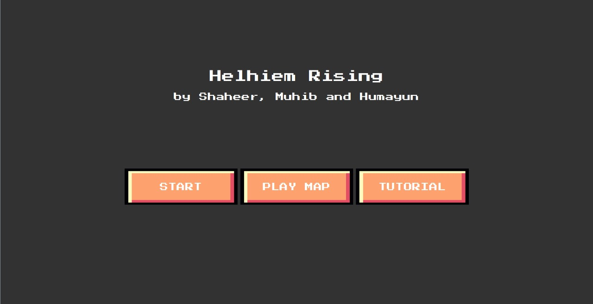
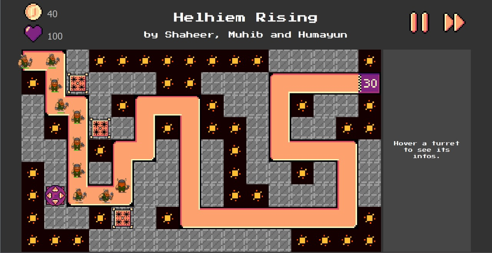
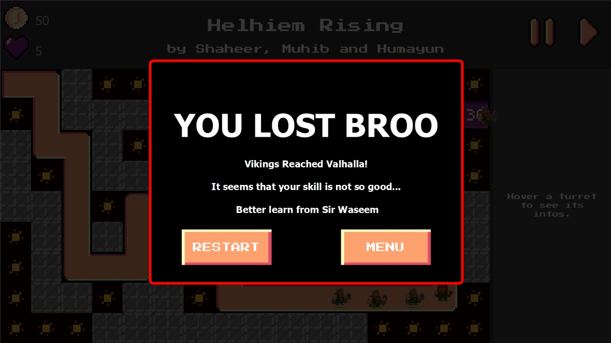

# 🏰 Tower Defense Game in C++ with Qt

Welcome to **Tower Defense**, a desktop strategy game developed in **C++** using the **Qt Framework**. In this game, players must tactically place towers to prevent waves of enemies from reaching their base. Each wave gets progressively harder, demanding quick thinking, strategic placement, and resource management.

---

## 📌 Table of Contents

- [Features](#features)
- [Gameplay Overview](#gameplay-overview)
- [Screenshots](#screenshots)
- [Tech Stack](#tech-stack)
- [Installation & Setup](#installation--setup)
- [File Structure](#file-structure)
- [Contributing](#contributing)
- [Future Improvements](#future-improvements)
- [License](#license)
- [Contact](#contact)

---

## ✨ Features

- ✅ **Fully interactive GUI** using Qt Widgets  
- ✅ **Multiple tower types** 
- ✅ **Progressive difficulty** with wave mechanics  
- ✅ **In-game economy**: earn coins, upgrade towers  
- ✅ **Drag-and-drop** tower placement system  
- ✅ **Real-time game stats display** (health, coins, score)  
- ✅ **Sound effects** for gameplay
- ✅ **Smooth animations** for enemy movement and combat  

---

## 🎮 Gameplay Overview

**Objective**: Defend your base from enemy waves by placing towers along a designated path.

### 📏 Rules

- Towers cost coins to place.
- Each enemy killed earns you coins.
- Enemies move along a fixed path; if they reach the base, you lose health.
- Game ends in **victory** if you survive all waves; **defeat** if your health drops to 0.

### 🎯 Controls

- **Left-click**: Select and place towers  
- **Right-click**: Cancel placement  
- **Toolbar**: Access tower types, stats, and game controls

  
## Tech Stack
- *Language*: C++

- *GUI Toolkit*: Qt 5 / Qt 6

- *IDE*: Qt Creator (recommended)

- *Graphics*: QPainter for custom rendering

- *Audio*: QMediaPlayer for sound effects
---

## 📬 Contact

For questions or feedback, feel free to reach out:

📧 [shaheerhasanx@gmail.com](mailto:shaheerhasanx@gmail.com)
📧 [humayunshahid89@gmail.com](mailto:humayunshahid89@gmail.com)
📧 [muhib.pro.310@gmail.com](mailto:muhib.pro.310@gmail.com)

## 🖼️ Screenshots

